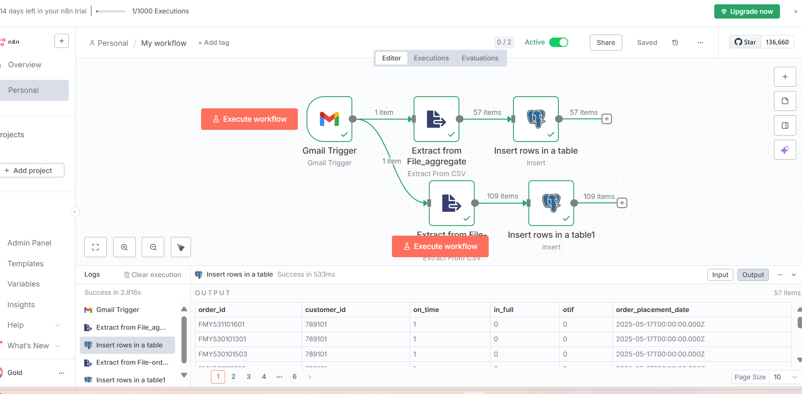
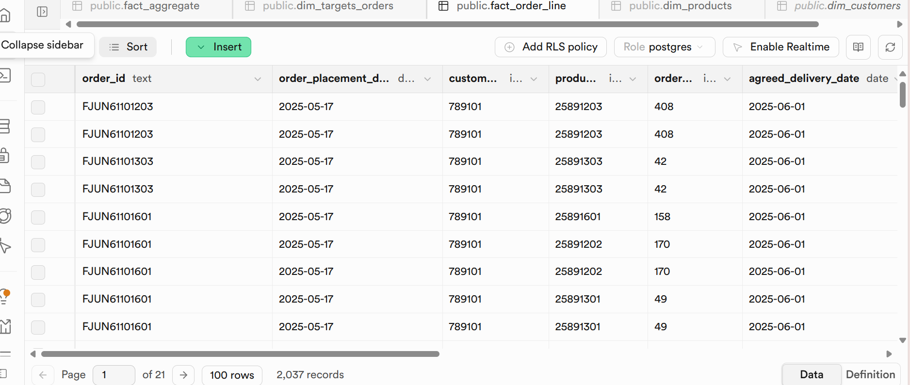

# ⚡ Automated Supply Chain ETL & Cloud Data Pipeline

**Business Goal:** To automate the end-to-end order-to-delivery analysis for the Atliq warehouse. This project eliminates manual data ingestion and reduces pipeline processing time by **50%** in a multi-city supply chain context.

---

## 🛠️ The Tech Stack
* **Automation:** n8n (Workflow Orchestration)
* **Database:** Supabase (Cloud PostgreSQL)
* **Analytics:** SQL & AI-Integrated Spreadsheets
* **Data Format:** JSON & CSV

---

## 🔄 1. Automated ETL Pipeline with n8n
I built a "hands-off" data pipeline that monitors incoming emails for raw order data.
* **Extract:** Automatic CSV retrieval from Gmail triggers.
* **Transform:** Data is parsed from CSV to JSON format.
* **Load:** Cleaned data is pushed directly into the Supabase cloud database every 5 minutes.

---

## 🗄️ 2. Cloud Data Architecture (Supabase)
To ensure reliable querying and high performance, I designed a relational schema in **Supabase (PostgreSQL)**. This includes fact tables for granular order lines and aggregate tables for high-level KPI tracking.

### SQL Schema Definitions:
I implemented structured tables to track **On-Time** and **In-Full (OTIF)** metrics, ensuring benchmarks are met for every customer.

| Component | SQL Definition Preview |
| :--- | :--- |
| **Order Line Fact** |  |
| **Aggregate Fact** |  |
| **Target Benchmarks** |  |

---

## 📊 3. Live Data Monitoring
With the pipeline running, Supabase serves as the "Single Source of Truth." The data is now ready for real-time visualization, allowing the business to pinpoint fulfillment bottlenecks as they happen.

---

## 📈 Business Results & Impact
* **Manual Effort Reduction:** Automating the ETL process saved 10+ hours of manual data entry per week.
* **Real-Time Insights:** Automated refreshes every 5 minutes allow for immediate response to delivery delays.
* **Error Minimization:** By removing manual CSV handling, data integrity increased significantly.

---

## 🚀 How to Run
1.  **n8n:** Import the `workflow.json` file provided in this repository.
2.  **SQL Setup:** Execute the table creation scripts located in the `/SQL` folder.
3.  **Connection:** Link your preferred BI tool (Power BI, Tableau, or Quadratic) to the Supabase PostgreSQL credentials.
